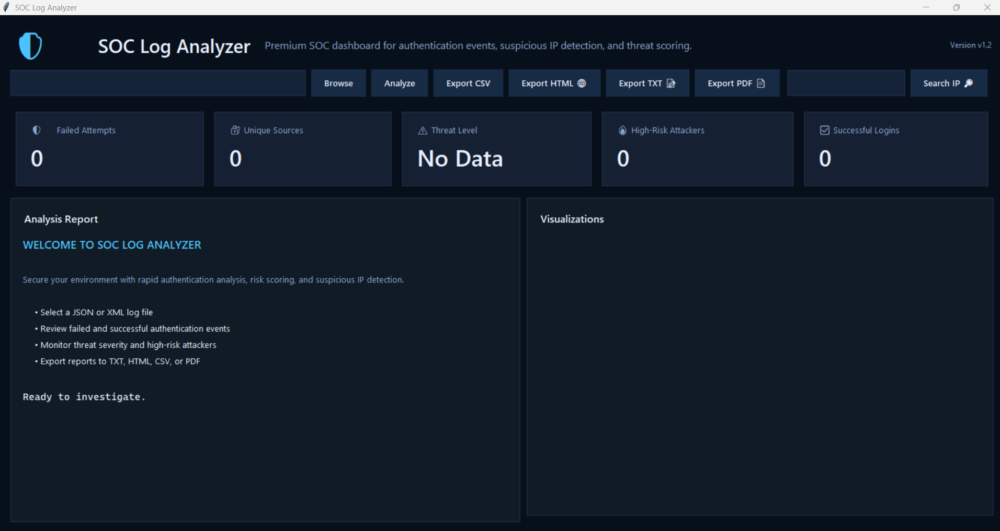

# 🔐 SOC Log Analyzer Pro

Enterprise-style Security Operations Center (SOC) log analysis and threat detection dashboard built using Python and Flask.

---

## 🚀 Features

- Real-time SOC-style dashboard
- Log upload & analysis engine
- Brute-force attack detection
- Severity-based alert classification
- Interactive security analytics charts
- Suspicious IP identification
- Search & filter alert system
- Professional dark-mode SOC UI
- JSON/XML log parsing support

---

## 🖥️ Dashboard Preview




---

## 🧠 Detection Capabilities

- Brute-force detection
- Suspicious authentication activity
- Failed login correlation
- Alert prioritization
- Threat scoring engine

---

## 🏗️ Architecture

Log Upload → Parsing Engine → Detection Engine → Alert Correlation → Dashboard Visualization

---

## ⚙️ Tech Stack

- Python
- Flask
- Bootstrap 5
- Chart.js
- HTML/CSS/JavaScript
- JSON/XML Parsing

---

## 📂 Project Structure

soc-log-analyzer/
│
├── app.py
├── templates/
├── static/
├── screenshots/
├── sample_attack_logs.json
└── requirements.txt

---

## ▶️ Installation

```bash
git clone https://github.com/sidkomandla-hue/soc-log-analyzer.git
cd soc-log-analyzer
pip install -r requirements.txt
python app.py
```

---

## 🌐 Access Dashboard

```bash
http://127.0.0.1:5000
```

---

## 📌 Future Improvements

- MITRE ATT&CK mapping
- Real-time log streaming
- Elasticsearch integration
- Machine learning anomaly detection
- SIEM correlation engine

---

## 👨‍💻 Author

Siddartha reddy komandla 
Cybersecurity & SOC Enthusiast